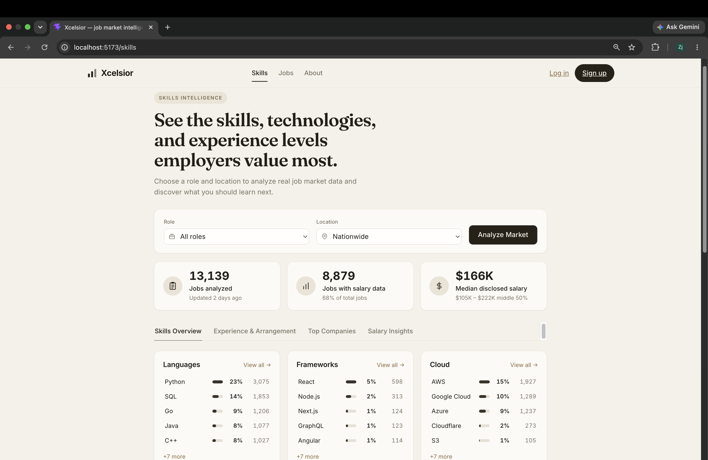
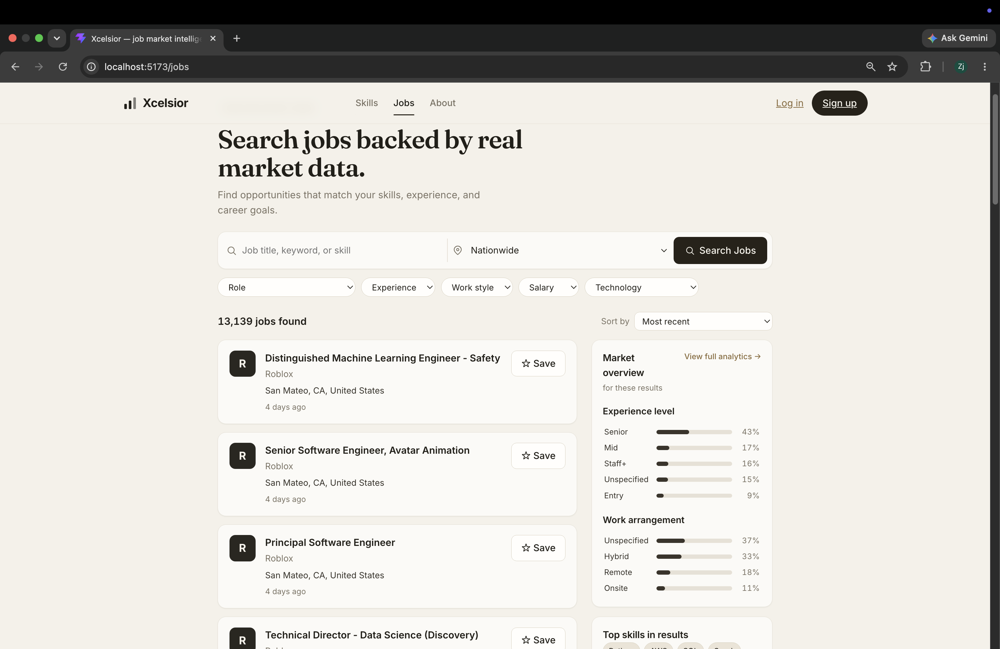

# Xcelsior
## Software Engineering Job Market Intelligence Platform
Xcelsior analyzes thousands of software engineering job postings to answer a simple question:
> **What skills, technologies, and experience levels are employers actually hiring for right now?**

Users can search by role, location, and radius to explore real hiring trends across:
- Programming languages
- Frameworks
- Cloud platforms
- Databases
- Infrastructure tools
- Salaries
- Work arrangements
- Experience levels
- Hiring companies

Every insight is generated from underlying job listings rather than manually curated data.

# Product Preview

## Market Intelligence Dashboard


## Skills Intelligence



## Job Search




# Features

## Market Analytics Dashboard
- Analyze job markets by title, location, and radius
- Identify the most requested technologies
- View salary distributions
- Understand hiring trends across experience levels
- Explore company demand

## Skills Intelligence
- Discover which technologies appear most frequently
- Compare technology demand across roles
- Explore individual skill pages
- Connect skills to real job opportunities

## Job Search
- Search thousands of software engineering roles
- Filter by:
  - Role
  - Location
  - Experience level
  - Work arrangement
  - Salary
  - Technology
- Save jobs
- View market context alongside search results

## Resume Matching
- Upload a resume profile
- Extract candidate skills
- Compare against job requirements
- Identify matching opportunities

# Architecture
```
                 Job Sources
                     |
                     v
        Ingestion + Extraction Pipeline
                     |
                     v
              PostgreSQL Database
                     |
          -------------------------
          |                       |
          v                       v
       FastAPI API          Analytics Engine
          |
          v
    React + TypeScript Frontend
```

# Technology Stack

## Frontend
- React
- TypeScript
- Vite
- TanStack Query
- React Router

## Backend
- Python
- FastAPI
- SQLAlchemy 2.0
- Alembic

## Database
- PostgreSQL 16

## Infrastructure
- Docker
- Docker Compose
- Render deployment configuration

## Data Pipeline
- Scheduled ingestion workers
- Job extraction pipeline
- Technology taxonomy matching
- Salary normalization
- Market snapshot generation

---

# Repository Structure

```
backend/
    FastAPI application
    database models
    API routes
    ingestion and extraction pipeline
    CLI workers

frontend/
    React single-page application
    dashboards
    job search interface
    authentication flows

data/
    technology taxonomy
    source metadata
    seed data

infra/
    deployment configuration

docs/
    architecture decision records
    project documentation
    screenshots
```

# Local Development

## Requirements
- Docker
- Node.js 20+
- uv (Python package manager)

## Start Database
```bash
docker compose up -d db
```

## Backend Setup
```bash
cd backend
uv sync
uv run alembic upgrade head
uv run uvicorn app.main:app --reload
```
Backend runs at:
```
http://localhost:8000
```
API documentation:
```
http://localhost:8000/docs
```

## Frontend Setup
```bash
cd frontend
npm install
npm run dev
```

Frontend runs at:
```
http://localhost:5173
```

# Data Sources
Xcelsior collects job listings from public applicant tracking system (ATS)
endpoints:
- Greenhouse
- Lever
These sources provide publicly available job postings that are normalized,
processed, and analyzed through the Xcelsior ingestion pipeline.

The platform only processes publicly available job information.

# Engineering Highlights

## Full-Stack Architecture
Built a complete production-style application with:
- React frontend
- FastAPI backend
- PostgreSQL database
- Automated migrations
- REST API design

## Data Engineering
Implemented:
- Job ingestion pipelines
- Data normalization
- Technology extraction
- Salary processing
- Market analytics generation

## Backend Engineering
Implemented:
- Authentication system
- User accounts
- Session-based security
- Database relationships
- API validation
- Rate limiting

## Frontend Engineering
Implemented:
- Responsive dashboards
- Interactive filtering
- Search experiences
- Data visualization
- Protected user page

# License
This project is licensed under the MIT License.